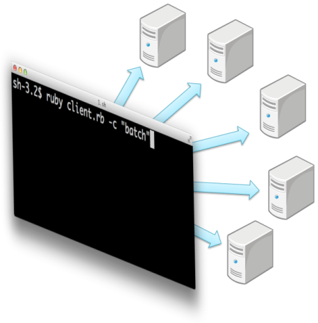

distss
======

"distss" is a distributed command execution system. You can use easily and quickly end the command by many node.
The Japanese document is [here](http://yasuharu.net/blog/2013/06/distss-introduce.html). English document is now writing... Please wait.

***

"distss" は分散コマンド実行システムです．簡単に分散してコマンドを高速に実行できます．
日本語のドキュメントは[こちら](http://yasuharu.net/blog/2013/06/distss-introduce.html)をご覧ください．

